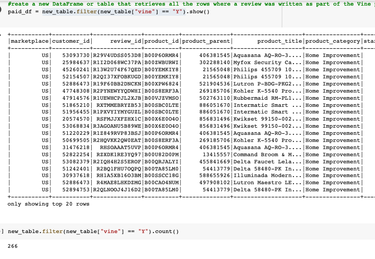
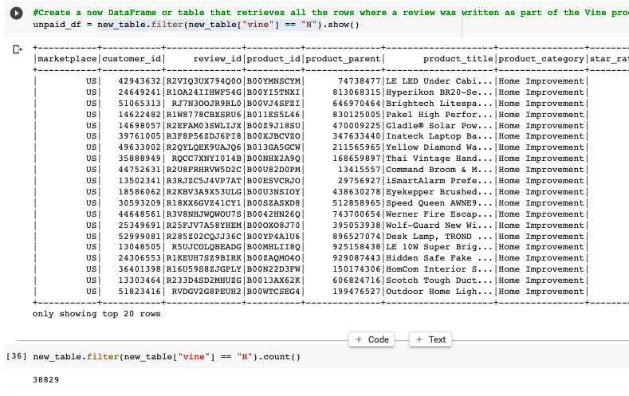
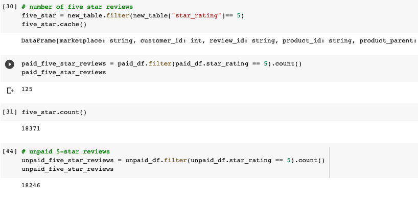
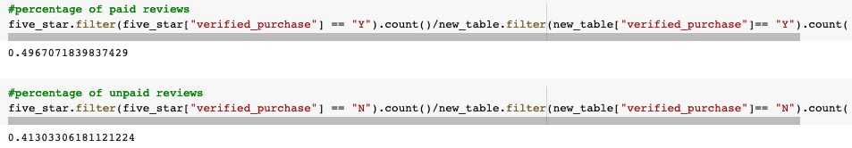

# Amazon_Vine_Analysis

Overview of the analysis: Explain the purpose of this analysis.
The Amazon Vine program is a service that allows manufacturers and publishers to receive reviews for their products. Companies like SellBy pay a small fee to Amazon and provide products to Amazon Vine members, who are then required to publish a review.

In this project, you’ll have access to approximately 50 datasets. Each one contains reviews of a specific product, from clothing apparel to wireless products. You’ll need to pick one of these datasets and use PySpark to perform the ETL process to extract the dataset, transform the data, connect to an AWS RDS instance, and load the transformed data into pgAdmin. Next, you’ll use PySpark, Pandas, or SQL to determine if there is any bias toward favorable reviews from Vine members in your dataset. Then, you’ll write a summary of the analysis for Jennifer to submit to the SellBy stakeholders.

### Results: 

### How many Vine reviews and non-Vine reviews were there?

* There were 266 vine reviews and 38,829 non-Vine reviews in the Home Improvement dataset

### How many Vine reviews were 5 stars? How many non-Vine reviews were 5 stars?

        

* Of all the 5 star reviews, 125 were Vine and 18,371 were non-Vine
        
### What percentage of Vine reviews were 5 stars? What percentage of non-Vine reviews were 5 stars?

        

* 49% of 5 star reviews were vine and  41% were non-Vine

## Summary: 

Our dataset does appear to have a slight positivity bias among our vine reviews at 49% compared to the 41% non-vine 5 star reviews. To futher analyze our Home Improvement dataset, we could continue to calculate the mean, median, and mode of the reviews to see the differences.
